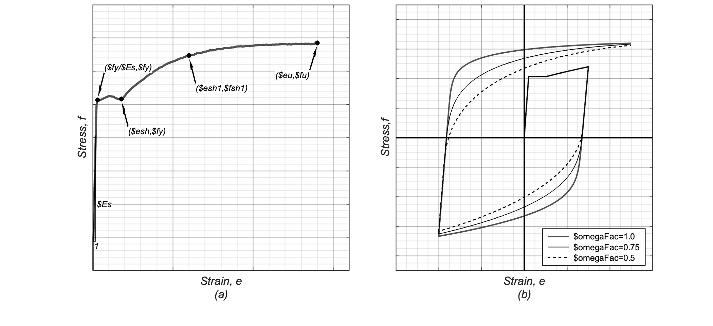
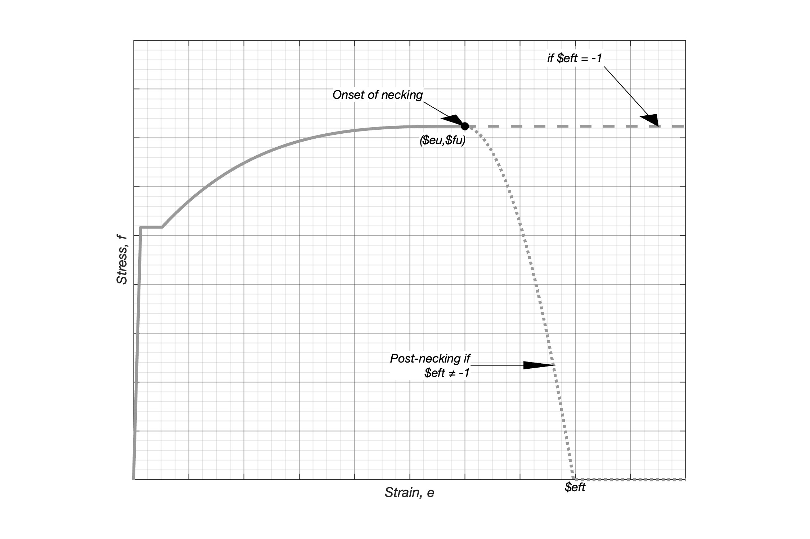
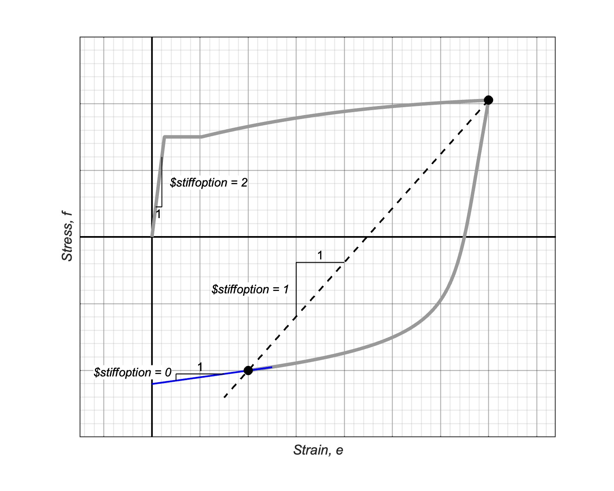
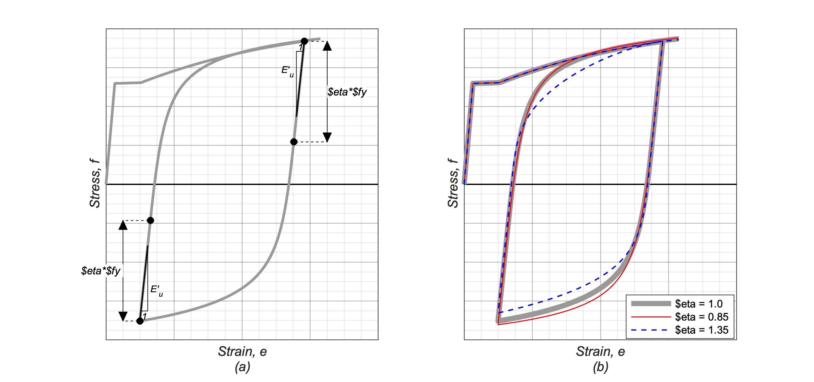

.. _SteelDRC:

SteelDRC Material
^^^^^^^^^^^^^^^^

This command is used to construct a uniaxial steel material based on the model by Dodd and Restrepo (1995) with 
stability and performance enhancements incorporated by Carreño et al. (2023).

.. function:: uniaxialMaterial SteelDRC $matTag $Es $fy $eu $fu $esh <-Psh $Psh> <-shPoint $esh1 $fsh1> <-omegaFactor $omegaFac> <-bausch $bauschType> <-fractStrain $eft> <-stiffOutput $stiffoption> <-eta eta> <-viscousDamper $C $alpha>

.. csv-table:: 
   :header: "Argument", "Type", "Description"
   :widths: 10, 10, 40

   $matTag, |integer|, "integer tag identifying material"
   $Es, |float|, "Young's modulus of the material"
   $fy, |float|, "Yield strength of the material"
   $eu, |float|, "Uniform strain in tension of the material"
   $fu, |float|, "Uniform stress in tension at $eu"
   $esh,|float|, "Strain at onset of strain hardening branch of material in pure tension"

**OPTIONAL PARAMETERS**

.. csv-table:: 
   :header: "Argument", "Type", "Description"
   :widths: 10, 10, 100

   $PSh, |float|, "Exponent of power function defining strain hardening of the material in pure tension (default = 3.0). see note 1"
   $esh1, |float|, "Strain at point within the strain hardening branch of the material. This parameter, along with $fsh1, defines the shape of the strain hardening branch, see note 1"
   $fsh1, |float|, "Stress at $esh1, see note 1"
   $eft, |float|, "Strain after onset of necking of the material where the stress capacity becomes 0.0 (default = -1.0, see note 2)"
   $omegaFac, |float|, "Factor controlling the shape of the Bauschinger curve after major reversals (default = 1.0)"
   $eta, |float|, "Factor controlling the length of the linear unloading branch after a strain reversal of the material, defined in terms of the yield strength $fy (default = 1.0)"
   $C, |float|, "Damping coefficient for viscous damper in parallel with the material (default = 0.0)"
   $alpha, |float|, "Strain rate exponent for viscous damper in parallel with the material (default = 1.0)"
   $bausch, |integer|, "| Flag indicating the method used to calculate stress-strain values within the Bauschinger curve (default = 1)
   | *   0 : Iterative method using Newton-Raphson (original by Dodd and Restrepo, with some improvements in speed and stability)
   | *   1 : Closed form using cubic (rational) Bezier curve"
   $stiffoption, |integer|, "| Flag indicating stiffness value returned by the material at each time step. This parameter was added to improve the convergence for frame models where the material undergoes large strains and the tangent stiffness is close to 0 (default = 0)
   | *   0 : Tangent stiffness
   | *   1 : Secant stiffness
   | *   2 : Initial stiffness ($Es)"
   

.. note::

   1. Both options -PSh and -shPoint define the shape of the strain hardening branch of the material in pure tension. If both parameters are defined by the user, $Psh will take precedence.
   2. The default value $eft = -1.0 represents a material that does not undergo a loss in stress capacity after the onset of necking in tension. For $eft ≠ -1, the stress capacity of the material will decrease after the onset of necking following a parabolic shape (see Figure 2)
   3. Recommended values for Gr. 60 reinforcing steel (Carreño, et al. 2023)

   .. csv-table:: 
      :header: "Argument", "Recommended Value"
      :widths: 10, 20

      $Es, "211000 MPa"
      $fy, "480 MPa"
      $esh, "0.007"
      $eu, "0.10" 
      $fu, "| 728 MPa (ASTM A615) 
      656 MPa (ASTM A706)"
      $PSh, "3.7"
      $omegaFac, "| 0.85 (ASTM A615)
      1.03 (ASTM A706)"
      $eta, "1.2"

.. [DoddRestrepo1995] Dodd,L.L and Restrepo-Posada J.I. (1995). "Model for predicting cyclic behavior of reinforcing steel". Journal of structural engineering 121.3 (1995):433-445
.. [CarrenoEtAl2023] Carreño R, Restrepo J.I., Conte J.P. "Model calibration and validation for the Dodd-Restrepo-Carreño constitutive cyclic stress-strain relationship for reinforcing steel". Journal of structural engineering (2023).

**FIGURES**

.. _fig-SteelDRC:

   Figure 1. SteelDRC Material -- Material parameters: (a) From stress-strain response in pure tension; (b) Shape of the bauschinger curve defined by $omegaFac 

   Figure 2. SteelDRC Material -- Effect of parameter $eft

   Figure 3. SteelDRC Material -- Material stiffness returned by the model according to $stiffoption

   Figure 4. SteelDRC Material -- Effect of parameter $eta on length of linear unloading branch post strain reversal

.. admonition:: Example 

   The following is used to construct a SteelDRC material with a tag of **1**, a yield strength of **420.0**, an initial tangent stiffness of **200000.0**, a uniform strain of **0.1 (10%)**, a uniform stress of **720** and a strain at the onset of strain hardening of **0.007 (0.7%)**

   1. **Tcl Code**

   .. code-block:: tcl

      uniaxialMaterial SteelDRC 200000.0 420.0 0.1 720.0 .007

Code Developed by: Rodrigo Carreño (Ph.D, P.E)